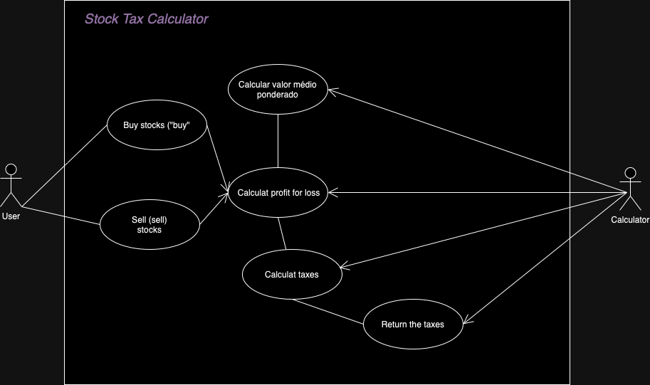
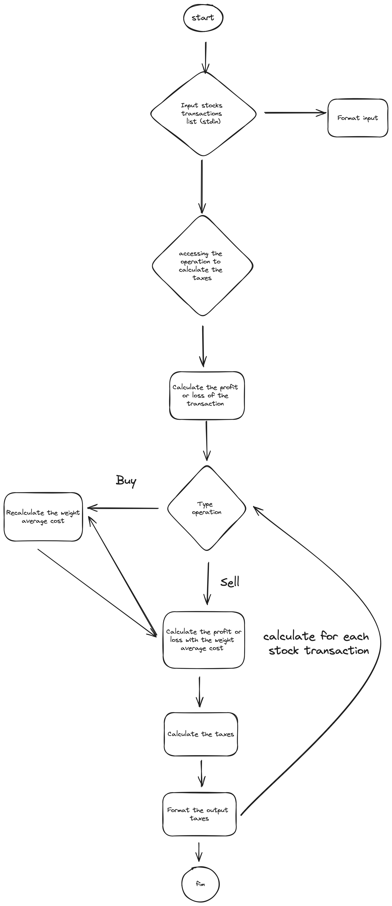

# Stock Tax Calculator 

The tax calculator for stock buying and selling operations.

This calculator simplifies the process of calculating taxes on both buying and selling operations. It considers factors such as purchase price, sale price, quantity of stocks, and any associated gains or losses. By providing accurate tax estimates, our tool empowers you to make informed decisions and optimize your investment strategy.


## Product architecture macro


## Product development architecture behavior

   

## Development 

### Development decisions 
The development was done using the TDD (Test-Driven Development) method, understanding the cases presented in the problem 
allowed to grasp what behaviors would be necessary for the program. 
I relied on the presented cases to create a high-level design of the product's functionality.
The cases data  directly influenced the core of the product providing  certainty in the behavior
supported by the presented data. 
this is was my approach

### Development tasks

1. Knowing the problem 
2. Drawing macro architecture
3. Drawing the development architecture behavior 
4. Desig integrated tests of the product based on the givin challenge

### Functions developments
    
1. ✅ Input data
   - Input stocks operations lists with types 'buy' and 'sell' 
      - Deal with Input Redirection using the stdin pattern
      - Deal with user typing using the stdin pattern
      - Format input lists because we can have more the one typed , empty and/or with line breaks
      - Return independent list of stocks transactions
2. ✅ Accessing the formatted list input
   - Deal with one stock operation as transaction
3. ✅ Calculate profit and loss 
   - If we have operations type as "buy" we need to calculate the weight average cost
     - Calculation method nova-média-ponderada = ((quantidade-de-ações-atual * média-ponderada-atual) + (quantidade-de-ações * valor-de-compra)) / (quantidade-de-ações-atual + quantidade-de-ações-compradas)
   - If we have operations type as "sell", use the weight average cost of the stocks operations 'buy' type
   - Calculate the profit and loss for each transaction 
4. ✅ Calculate Taxes
   - Dont's:
      - Don't calculate taxes for stocks transactions 'buy' type
      - Don't calculate taxes if the total cost of the transactions less then 20.000
      - Don't calculate taxes if the total cost of the transactions less then the profit we had
      - Don't calculate taxes if loss more then 0
   - Do's
     - Calculate taxes if had cumulative loss and profit
     - Calculate taxes if had profit without cumulative loss


## How to compile and execute

### First way - Type the stocks transactions

#### Cases input

   1. Case 01
   ```
   [{"operation":"buy", "unit-cost":10.00, "quantity": 100}, {"operation":"sell", "unit-cost":15.00, "quantity": 50},{"operation":"sell", "unit-cost":15.00, "quantity": 50}]
   ```
   2. Case 02
   ```
   [{"operation":"buy", "unit-cost":10.00, "quantity": 10000}, {"operation":"sell", "unit-cost":20.00, "quantity": 5000}, {"operation":"sell", "unit-cost":5.00, "quantity": 5000}]
   ```
   3. Case 01 and 02
   ```
   [{"operation":"buy", "unit-cost":10.00, "quantity": 100}, {"operation":"sell", "unit-cost":15.00, "quantity": 50},{"operation":"sell", "unit-cost":15.00, "quantity": 50}] [{"operation":"buy", "unit-cost":10.00, "quantity": 10000}, {"operation":"sell", "unit-cost":20.00, "quantity": 5000}, {"operation":"sell", "unit-cost":5.00, "quantity": 5000}]
   ```
   4. Case 03
   ```
   [{"operation":"buy", "unit-cost":10.00, "quantity": 10000}, {"operation":"sell", "unit-cost":5.00, "quantity": 5000}, {"operation":"sell", "unit-cost":20.00, "quantity": 3000}]
   ```
   5. Case 04
   ```
   [{"operation":"buy", "unit-cost":10.00, "quantity": 10000}, {"operation":"buy", "unit-cost":25.00, "quantity": 5000}, {"operation":"sell", "unit-cost":15.00, "quantity": 10000}]
   ```
   6. Case 05
   ```
   [{"operation":"buy", "unit-cost":10.00, "quantity": 10000}, {"operation":"buy", "unit-cost":25.00, "quantity": 5000}, {"operation":"sell", "unit-cost":15.00, "quantity": 10000}, {"operation":"sell", "unit-cost":25.00, "quantity": 5000}]
   ```
   7. Case 06
   ```
   [{"operation":"buy", "unit-cost":10.00, "quantity": 10000}, {"operation":"sell", "unit-cost":2.00, "quantity": 5000}, {"operation":"sell", "unit-cost":20.00, "quantity": 2000}, {"operation":"sell", "unit-cost":20.00, "quantity": 2000}, {"operation":"sell", "unit-cost":25.00, "quantity": 1000}]
   ```
   8. Case 07
   ```
   [{"operation":"buy", "unit-cost":10.00, "quantity": 10000}, {"operation":"sell", "unit-cost":2.00, "quantity": 5000}, {"operation":"sell", "unit-cost":20.00, "quantity": 2000}, {"operation":"sell", "unit-cost":20.00, "quantity": 2000}, {"operation":"sell", "unit-cost":25.00, "quantity": 1000}, {"operation":"buy", "unit-cost":20.00, "quantity": 10000}, {"operation":"sell", "unit-cost":15.00, "quantity": 5000}, {"operation":"sell", "unit-cost":30.00, "quantity": 4350}, {"operation":"sell", "unit-cost":30.00, "quantity": 650}]
   ```

#### How to run

1. After the product code zip download, unzip the file
2. Access the source code file

```bash 
cd carolinesoares-code-challenge-2024 
```
3. Run this command to execute the programa without the Input Redirection

```bash 
python app/calcute_taxes_capital_gain.py
```

4. After the programa start, input the list of stocks transations. Please copy what Case you want to test in the list above

### Second way - Input Redirect stocks transactions

#### Cases Files
| Case | File | Command                                                                     | 
|------|------|-----------------------------------------------------------------------------|
| Case 01 | case01.txt | ``` python main.py < documents/cases_files/case01.txt```                    |
| Case 02 | case02.txt | ``` python main.py < documents/cases_files/case02.txt```    |
| Case 01 and 02 | case01n02.txt | ``` python main.py < documents/cases_files/case01n02.txt``` |
| Case 03 | case03.txt | ``` python main.py < documents/cases_files/case03.txt```    |
| Case 04 | case04.txt | ``` python main.py < documents/cases_files/case04.txt```    |
| Case 05 | case05.txt | ``` python main.py < documents/cases_files/case05.txt```    |
| Case 06 | case06.txt | ``` python main.py < documents/cases_files/case06.txt```    |
| Case 07 | case07.txt | ``` python main.py < documents/cases_files/case07.txt```    |

#### How to run

1. After the product code zip download, unzip the file
2. Run this command to acess the code file

```bash 
cd carolinesoares-code-challenge-2024 
```
3. Run this command to execute the programa the Input Redirection, please select what case you want to run with the input redirection list above

```bash 
python app/calcute_taxes_capital_gain.py < case01.txt
```


## How to run united and integraded tests

1. After the product code zip download, unzip the file
2. Access the source code file
```bash 
cd carolinesoares-code-challenge-2024 
```
3. Create a python environment
```bash
python -m venv venv
```
4. Active the python environment
```bash
source venv/bin/activate
```
5. Upgrate the pip framework to run any python file
```bash
pip install --upgrade pip
```
6. Install pytest framework with this tests was writted
```bash
pip install pytest
```
7. Run the command ``` pytest``` to execute all tests


